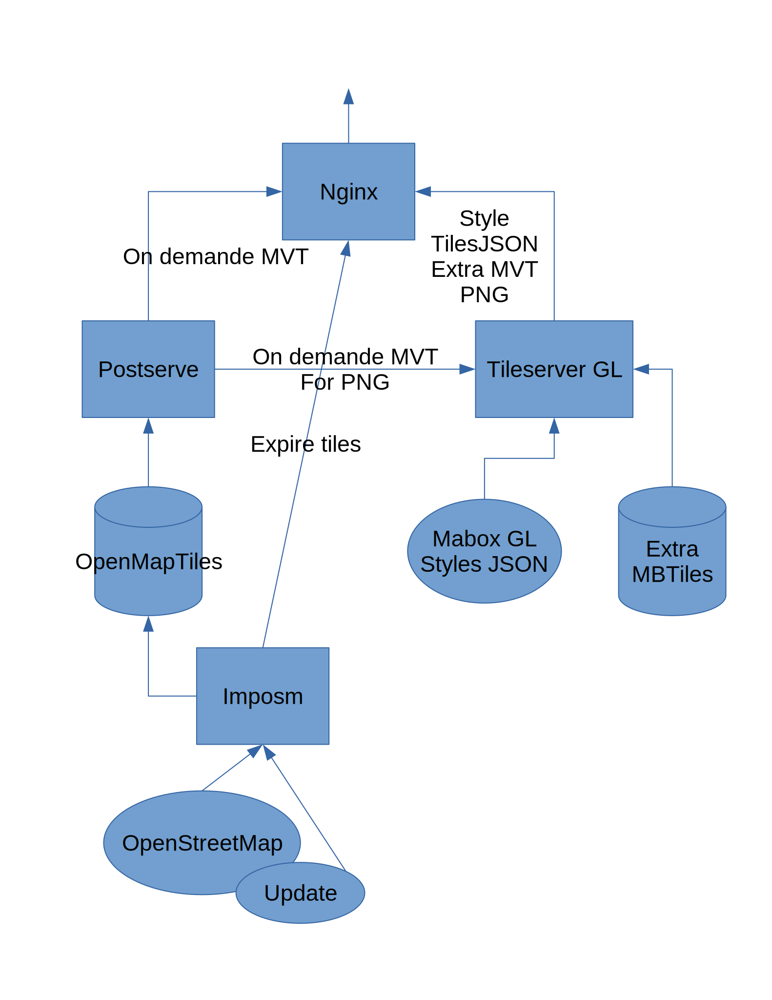

# Makina Maps

Full Stack to Build, Serve and Update your own Vector and Raster Tiles from OpenStreetMap Data.

Makina Maps render tiles on request, no need to pre-generate all tiles on huge MBTiles archive: fast setup, fast update.

* Build Vector Tiles on request from the [OpenMapTiles](https://github.com/openmaptiles/openmaptiles) database and schema
* Served Mapbox GL Styles, with sprites and fonts with embed [TileServer GL](https://github.com/maptiler/tileserver-gl)
* Render Raster version of Mapbox GL style (TileServer GL)
* Cache vector and raster tiles (NGINX)
* Update from OpenStreetMap


## Install

Install as system dependencies: git, make, docker and docker-compose.

### Clone Git reposittory

Get the project:
```
git clone --recurse-submodules https://github.com/makina-maps/makina-maps.git
cd makina-maps
```

Get default GL Json Styles and Fonts, or use your owns:
```
git clone -b gh-pages https://github.com/openmaptiles/osm-bright-gl-style.git tileserver-gl/styles/osm-bright-gl-style
git clone -b gh-pages https://github.com/openmaptiles/klokantech-basic-gl-style.git tileserver-gl/styles/klokantech-basic-gl-style
git clone -b gh-pages https://github.com/makinacorpus/cassini-gl-style.git tileserver-gl/styles/cassini-gl-style
git clone -b gh-pages https://github.com/openmaptiles/fonts.git tileserver-gl/fonts
```

### Setup Docker images

Build and Fetch docker images:
```
docker-compose build
cd openmaptiles
docker-compose pull
```


## Import OpenStreetMap Data

### OpenMapTiles initial Load

Use the management scripts from `openmaptiles` directory.
```
cd openmaptiles
```

Import generic data, not from OpenStreetMap:
```
../scripts/10-import-generic.sh
```

Prepare import by download OpenStreetMap data and setup configuration for an area. The area names are from [Geofabrik](http://download.geofabrik.de/), store it in the `data` directory:
```
../scripts/20-import-prepare.sh andorra
```

Import the OpenStreetMap extract:
```
../scripts/30-import-extract.sh
```

The scripts `20-import-prepare.sh` or `30-import-extract.sh` can be replayed with the same or other area.

### Update OpenMapTiles data

From the `openmaptiles` directory.

Run the updater. It loops over pending updates, then wait for new update.
```
../scripts/40-update.sh
```
You can stop with CTRL-C, it will quit at the end of the current update.

Imposm marks tiles to expire. Then a script in the nginx container watches and expires tiles in the nginx cache.


## Run the tiles server

From root directory. Start the OpenMapTiles database and the web server.
```
(cd openmaptiles && make start-db && make start-postserve)
docker-compose up
```

Access to cached tiles and services at:

* Demo: http://0.0.0.0:8080
* OpenMapTiles TileJson: http://0.0.0.0:8080/data/v3.json
* Default "Bright" GL JSON Style: http://0.0.0.0:8080/styles/bright/style.json
* Default "Bright" raster:
  * TileJSON: http://0.0.0.0:8080/styles/bright.json
  * Raster tiles: http://0.0.0.0:8080/styles/bright/{z}/{x}/{y}.png

## Configuration

Configuration file is Tileserver-GL configuration file `tileserver-gl/config.json`.

Get more detail about this configuration at the [Tileserver-GL documentation](https://tileserver.readthedocs.io/en/latest/config.html).

### Styles

```js
  "styles": {
    "bright": {
      // Path to the Mapbox-GL Style
      "style": "osm-bright-gl-style/style-local.json"
    },
    "basic": {
      // Disable the render as raster (no PNG...)
      "serve_rendered": false,
      "style": "klokantech-basic-gl-style/style-local.json"
    }
  },
```

### Vector tiles data sources

Where the vector tiles are come from. Can be generated on the fly from OpenMapTiles database, other external source or local MBTiles files.
```js
  "data": {
    // Name of the source, here OpenMapTiles v3
    "v3": {
      // On demand tiles, internal URL
      // Alternatively could be a MBTiles
      // This option is specific to Makina Maps and not available in standard Tileserver-GL
      "remote_tilejson": "http://postserve:8090/"
      }
    }
  }
```

### Public URLs

The `domains` may be adjusted. There used only for raster tiles.

```js
    "domains": [
      // Publicly available domains, for raster tiles
      "a.example.com",
      "b.example.com"
    ],
```

The vector tiles source (tilejon) should be overwritten to expose public URLs.
```js
  "data": {
    "v3": {
      "remote_tilejson": "http://postserve:8090/",
      "tilejson": {
        "tiles": [
          // Public available URLs of vector tiles
          "http://a.example.com/data/v3/{z}/{x}/{y}.pbf",
          "http://b.example.com/data/v3/{z}/{x}/{y}.pbf"
        ]
      }
    }
  }
```

The tiles URLs in tilejson from vector tiles producer are internal to the docker-compose and refer to internal host. Should be redefined as public URLs for outside world.


## Overview



Architecture overview, workflow.

```ascii-art
               Nginx                  OpenMapTiles
               Cache   TileServer-GL    postserve

tilejson <------ X <-------- X <----------- X
                                            |
                                   ,--------'
                                   |
pbf tiles <----- X <---------------|------- X
                 |                 |
                  `--------> X <---'
                             |
png tiles <----- X <---------'
```


## Benchmark

### Import size and time

Specific only on 8 CPUs (import-osm, import-sql and psql-analyze, without docker pulling time).

| Area | PBF size | Imposm cache | Postgres size | Time 8 CPUs / SSD | Time 4 CPUs / HD | 1 d Update |
|-|-:|-:|-:|-:|-:|-:|
| Andorra | 243 Ko | 3.3 Mo | 3.5 Go | 36 s | 1 min 21 s | |
| Alsace | 100 Mo | 156 Mo | 4.5 Go | 3 min 20 s | 4 min 32 s | |
| Aquitaine | 214 Mo | 374 Mo | 6.4 Go | 6 min 40 s | 8 m 39 s | 1 min |
| Austria | 559 Mo | 781 Mo| 9.4 Go  | 23 min | 26 min 35 s | |
| France | 3.5 Go | | 35 Go | 105 min | 210 min 58 s | |
| Europe | 20 Go | 35 Go | 206 Go | 12 h 22 min | 3 d 23 h | 3 h |

### Database

Size of Imposm cache.
```
docker-compose run --rm openmaptiles-tools bash -c "du -h /cache/"
```

Size of the current database.
```
docker-compose exec postgres psql openmaptiles openmaptiles -c "
SELECT
  pg_size_pretty(sum(pg_relation_size(pg_catalog.pg_class.oid))::bigint) as table_size
FROM
  pg_catalog.pg_class
  JOIN pg_catalog.pg_namespace ON
    relnamespace = pg_catalog.pg_namespace.oid
WHERE
  pg_catalog.pg_namespace.nspname = 'public';
"
```

Show slow queries
```sql
ALTER DATABASE openmaptiles SET log_min_duration_statement = 100;
```

And grep slowest queries
```
docker logs openmaptiles_postgres_1 |& grep 'LOG:  duration:' | cut -d ':' -f 3- | sed 's/BOX3D([^)]*)//g' | sort -n
```

### Metrics

Server metrics could be available on StatsD / Graphite on http://localhost:8899

The metrics logs are not used by default and could be enabled by adding `docker-compose-benchmark.yml` to docker-compose and uncommenting the `metrics` section from `config.yaml`.


### Queries

Use [Artillery.io](https://artillery.io) to benchmark the tiles server. Use `docker-compose-benchmark.yml`.

Generate one set of tiles coordinates to be requested. Coordinates are tile ranges at zoom level 14 (https://www.maptiler.com/google-maps-coordinates-tile-bounds-projection/)
```
# Continantal Europe
docker-compose -f docker-compose.yml -f docker-compose-benchmark.yml run --rm artillery bash -c 'ruby artillery.rb 8445-9451 5356-5891 | egrep "^14," > artillery.csv'
# Aquitaine
docker-compose -f docker-compose.yml -f docker-compose-benchmark.yml run --rm artillery bash -c 'ruby artillery.rb 8000-8200 5800-6000 | egrep "^14," > artillery.csv'
# Bordeaux area
docker-compose -f docker-compose.yml -f docker-compose-benchmark.yml run --rm artillery bash -c 'ruby artillery.rb 8157-8171 5895-5909 | egrep "^14," > artillery.csv'
# Paris area
docker-compose -f docker-compose.yml -f docker-compose-benchmark.yml run --rm artillery bash -c 'ruby artillery.rb 8285-8311 5621-5645 | egrep "^14," > artillery.csv'
```

Clear the tiles cache first. Then request the tiles server.
```
docker-compose run --rm nginx bash -c "rm -fr /cache/*"
docker-compose -f docker-compose.yml -f docker-compose-benchmark.yml run --rm artillery artillery run artillery.yaml
```

Random order tiles request on mixed urban and rural area, without concurrency. Time from server, HTTP included.

| Source | Delay |
|-|-:|
| Zoom 12 mixte Europe | 50 ms |
| Zoom 13, mixte Europe | 49 ms |
| Zoom 14, mixte Europe| 60 ms |
| Zoom 14, urban Paris | 250 ms |
| From cache | 5 ms |