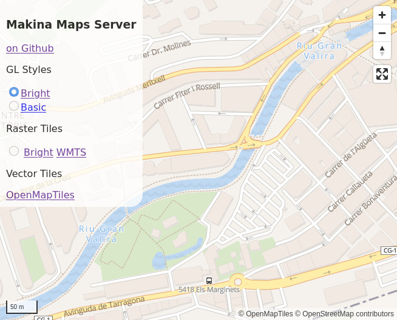

# Makina Maps

Vector Tiles server based on [OpenMapTiles](https://github.com/openmaptiles/openmaptiles) and [Kartotherian](https://github.com/kartotherian/kartotherian) with the ability to:

* Build Vector Tiles on Demand from the OpenMapTiles database
* Served Mapbox GL Style, with sprites and fonts
* Render Raster version of Mapbox GL style
* Cache vector and Raster tiles



## Install

```
git clone https://github.com/makinacorpus/makina-maps.git
cd makina-maps
git submodule update --init --recursive
```

### OpenMapTiles Load

From the `openmaptiles` directory.
```
cd openmaptiles
```

Fix OpenMapTiles (to allow usage of imposm config at import-osm step)
```
patch -p1 < ../docker-compose-openmaptiles.patch
```

Download OpenStreetMap extract:
```
wget http://download.geofabrik.de/europe/andorra-latest.osm.pbf -P data/
```

Setup the configuration for data updater:
```
echo '{"replication_url": "http://download.geofabrik.de/europe/andorra-updates/","replication_interval": "24h"}' > data/imposm-config.json
```

Prepare OpenMapTiles configuration
```
sed -i "s/DIFF_MODE=false/DIFF_MODE=true/" .env
make
```

Import generic data
```
docker-compose up -d postgres && sleep 10 && \
docker-compose run --rm import-water && \
docker-compose run --rm import-osmborder && \
docker-compose run --rm import-natural-earth && \
docker-compose run --rm import-lakelines
```

Import OpenStreetMap data

Force to clean previously imported OpenStreetMap data.
```
docker-compose up -d postgres
docker-compose exec postgres psql openmaptiles openmaptiles -c "
DROP SCHEMA backup CASCADE
"
```

Time the import of a pbf from data directory
```
docker-compose up -d postgres && sleep 10 && \
time bash -c "\
docker-compose run -e CONFIG_JSON=/import/imposm-config.json --rm import-osm && \
docker-compose run --rm import-wikidata && \
docker-compose run --rm import-sql && \
make psql-analyze
"
```

Then clear the tile cache (re-import data only). From project root directory:
```
docker-compose exec redis redis-cli FLUSHALL
```

### Run the tiles server

From root directory. Start the OpenMapTiles database and the web server.
```
(cd openmaptiles && docker-compose up -d postgres) && sleep 10
docker-compose up
```

The direct acces to cached tiles and services at:

* OpenMapTiles TileJson: http://0.0.0.0:6534/v3/info.json
* Default "Basic" GL JSON Style: http://0.0.0.0:6534/styles/basic/style.json
* Default "Basic" raster:
  * TileJSON: http://0.0.0.0:6533/basic/info.json
  * Raster tiles: http://0.0.0.0:6533/basic/{z}/{x}/{y}.png
  * Demo: http://0.0.0.0:6533/?s=basic

### Configuration

Configuration files are Kartotherian configuration files `config.yaml` and `sources.yaml`.

#### config.yaml

Specific configuration part.

```yaml
services:
  - name: kartotherian
      variables:
        OPENMAPTILES_V3_TILES_URLS:
        - http://localhost:6533/openmaptiles_v3/{z}/{x}/{y}.pbf
        - http://127.0.0.1:6533/openmaptiles_v3/{z}/{x}/{y}.pbf
        - http://[::1]:6533/openmaptiles_v3/{z}/{x}/{y}.pbf
        OPENMAPTILES_V3_TILES_URLS_INTERNAL:
        - http://kartotherian:6533/openmaptiles_v3_raster/{z}/{x}/{y}.pbf
        BASIC_TILES_URLS:
        - http://localhost:6533/basic/{z}/{x}/{y}.png
        - http://127.0.0.1:6533/basic/{z}/{x}/{y}.png
        - http://[::1]:6533/basic/{z}/{x}/{y}.png

      modules:
      - "tilelive-tmstyle"
      - "@kartotherian/overzoom"
      - "@kartotherian/substantial"
      - "@kartotherian/tilelive-tmsource"
      - "@mapbox/tilejson"
      - kartotherian_cache # Local cache
      - "kartotherian_cache/RedisStore" # Redis cache Storage
      - kartotherian_gl # Render raster tiles

      requestHandlers:
      - kartotherian_gl_style_server # Serve Mapbox GL Style
      - kartotherian_sources_list_server # Serve the list of sources
      - "kartotherian_cache/expire" # Cache expiration Endpoint

      sources_server:
        prefix_public: http://localhost:6533 # External hostname, should be changed to https://example.com

      styles:
        prefix_public: http://localhost:6533 # External hostname, should be changed to https://example.com
        prefix_internal: http://kartotherian:6533 # Internal, required for render raster
        paths:
          styles: /styles # Path to styles, in the Docker container
          fonts: /fonts # Path to fonts, in the Docker container
        font_fallback: Klokantech Noto Sans Regular # Serve this font when the font is not found
        styles:
          basic: # Name of the style
            style: klokantech-basic-gl-style/style-local.json # Relative path the style JSON
            sources_map: # Map of the style source (`mbtiles://{v3}`) to source name from `sources.yaml`
              v3: openmaptiles_v3
            sources_map_internal: # Internal, required for render raster
              v3: openmaptiles_v3_raster
```

#### styles.yaml

Cache setup

```yaml
openmaptiles_v3_cache: # Redis Tiles Storage
  uri: redis://
  params:
    host: redis
    namespace: openmaptiles_v3_cache

openmaptiles_v3:
  uri: cache://
  params:
    source: {ref: openmaptiles_v3_overzoom} # Tiles Source
    storage: {ref: openmaptiles_v3_cache} # Cache Tiles Storage
    minzoom: 0 # Min zoom level to be cached
    maxzoom: 14 # Max zoom level to be cached
    http_headers: # Type the contcontent fetch from the cache, with any HTTP headers
      Content-Type: application/x-protobuf
      # Content-Type: image/png
      x-tilelive-contains-data: true
      Content-Encoding: gzip
```

Mapbox GL native raster

```yaml
source_name:
  uri: kartotherian+gl:///
  params:
    style: basic # Style defined in to `config.yaml`
```

## Update

### OpenMapTiles Update

From the `openmaptiles` directory.

Run the updater. It loops over pending updates, then wait for new update.
```
docker-compose run --rm -e CONFIG_JSON=/import/imposm-config.json -e TILES_DIR=/import/expire_tiles update-osm
```
Stop it when the data are up to date with CTRL-C.

Update the precomputed data:
```
docker-compose run --rm import-sql && \
make psql-analyze
```

### Tiles Cache Expiration

```
docker-compose exec kartotherian bash -c "
  find /data/expire_tiles/ -name *.tiles | xargs cat > /data/expire_tiles/expire_tiles.tiles && \
  curl http://localhost:6533/cache_expiration && \
  rm -fr /data/expire_tiles/*
"
```

## Benchmark

### Import size and time

Specific only on 8CPU (import-osm, import-sql and psql-analyze, without docker pulling time).

| Area | PBF size | Imposm cache | Postgres size | Time 8 CPUs / SSD | Time 4 CPUs / HD |
|-|-:|-:|-:|-:|
| Andorra | 243 Ko | 3.3 Mo | 3.5 Go | 36 s | 1 min 21 s |
| Alsace | 100 Mo | 156 Mo | 4.5 Go | 3 min 20 s | 4 min 32 s |
| Aquitaine | 214 Mo | 374 Mo | 6.4 Go | 6 min 40 s | 8 m 39 s |
| Austria | 559 Mo | 781 Mo| 9.4 Go  | 23 min | 26 min 35 s |
| France | 3.5 Go | | 35 Go | 105 min | 210 min 58 s |
| Europe | 20 Go | | | | | +3d 7h |

### Database

Size of Imposm cache.
```
(cd openmaptiles && docker-compose run import-osm bash -c "du -h /cache/")
```

Size of the current database.
```
docker-compose exec postgres psql openmaptiles openmaptiles -c "
SELECT
  pg_size_pretty(sum(pg_relation_size(pg_catalog.pg_class.oid))::bigint) as table_size
FROM
  pg_catalog.pg_class
  JOIN pg_catalog.pg_namespace ON
    relnamespace = pg_catalog.pg_namespace.oid
WHERE
  pg_catalog.pg_namespace.nspname = 'public';
"
```

Show slow queries
```sql
ALTER DATABASE openmaptiles SET log_min_duration_statement = 100;
```

And grep slowest queries
```
docker logs openmaptiles_postgres_1 |& grep 'LOG:  duration:' | cut -d ':' -f 3- | sed 's/BOX3D([^)]*)//g' | sort -n
```

### Metrics

Server metrics could be available on StatsD / Graphite on http://localhost:8899

The metrics logs are disabled by default and could be enabled in `docker-compose.yml` by uncommenting the `graphite` service and the `metrics` section from `config.yaml`.
